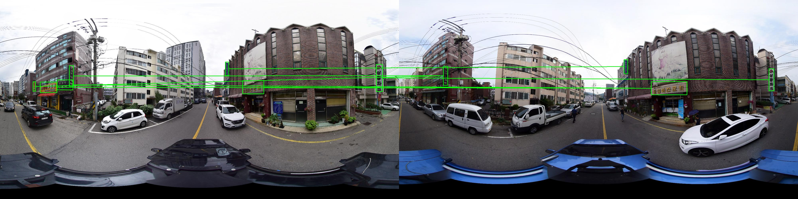
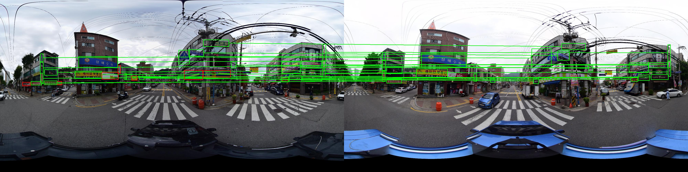
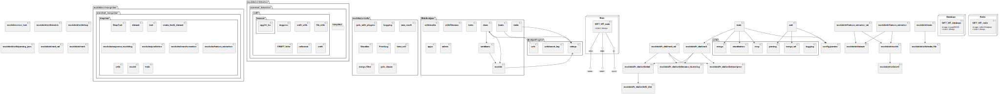

# Signboard Retrieval with SIFT, VIT

Python implementation

This project implemented matching of shopping mall signboards using this SIFT and VIT features

**[Jaechan Jo](mailto:jjc123a@naver.com), Wonil Lee**





### Performace by method
|Method| Recall   | Precision | F1-score |
|------|----------|-----------|----------|
|SIFT| 0.42     | 0.55      | 0.48     |
|VIT| 0.82     | **0.80**  | **0.81**     |
|SIFT+VIT| 0.69     | 0.74      | 0.71     |
|SuperPoint + Superglue| 0.82     | 0.76      | 0.79     |
|LoFTR| **0.85** | 0.77      | **0.81** |

## Method Overview
1. Panorama is first matched with [CosPlace](https://github.com/gmberton/CosPlace)
2. Detect signs with trained [yolov7](https://github.com/WongKinYiu/yolov7) from ours [datasets](https://github.com/jaechanjo/Signboard_Dataset_for_Post-OCR-Parsing) : [SCA-ObjectDetection](https://github.com/sogang-mm/SCA-ObjectDetection)
3. Crop the signboard, run the SIFT, VIT and OCR matching algorithms, and output the result **(OURS)**


## Evaluation

For installation instructions, see the link below.

[HowToEval](docs/HowToEval.md)

## Setup

For Setup instructions, see the link below.

[HowToSetup](docs/HowToSetup.md)

## Usage

For Usage instructions, see the link below.

[HowToUse](docs/HowToUse.md)

## How to run RESTful API Server

### Start API Server

if you execute command in order, docker container run in background.

```shell
# in Host
git clone -b main https://${PERSONAL_TOKEN}@github.com/jaechanjo/Signboard_Retrieval.git SIFT_VIT
cd SIFT_VIT/
docker-compose up -d --build
docker attach SIFT_VIT_main

# in docker container
source ~/.bashrc
sh scripts/entrypoint.sh 
sh scripts/server_start.sh
```
### Shutdown API Server

- if you execute following command, api server in background is stopped.

```shell
sh scripts/server_shutdown.sh
```

## Others

- This implementation was developed by **[Jaechan Jo](mailto:jjc123a@naver.com), Wonil Lee.** 

If you have any problem or error during running code, please email to us.


### Infrastructure model


---
