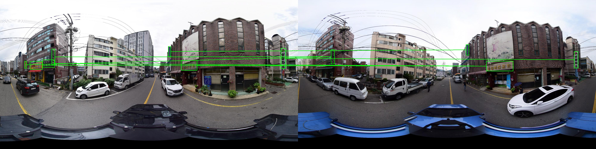
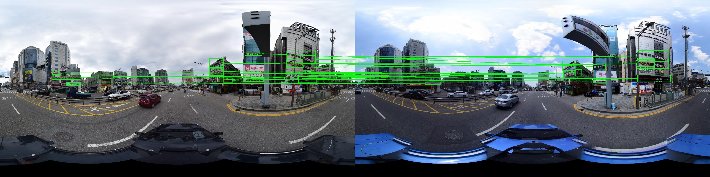
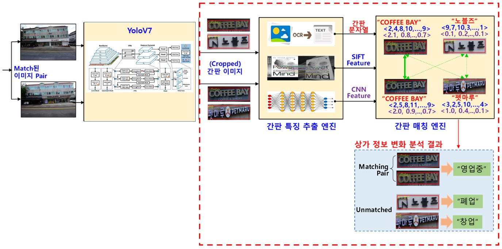

# SignMatching with SIFT, VIT

Python implementation

**[Jaechan Jo](mailto:jjc123a@naver.com), Wonil Lee**





## Method Overview
1. Panorama is first matched with [CosPlace](https://github.com/gmberton/CosPlace)
2. Detect signs with trained [yolov7](https://github.com/WongKinYiu/yolov7) from ours datasets : [Signboard_Dataset_for_Post-OCR-Parsing](https://github.com/jaechanjo/Signboard_Dataset_for_Post-OCR-Parsing)
3. Crop the signboard, run the SIFT and VIT matching algorithms, and output the result **(OURS)**



## Evaluation

### 1. Panorama datasets
<table style="width:100%">
  <tr>
    <th>Dataset details</th>
    <th>Count</th>
  </tr>
  <tr>
    <td><b>total pairs</b></td>
    <td><b>97</b></td>
  </tr>
  <tr>
    <td>query cropped signs</td>
    <td>1,301</td>
  </tr>
  <tr>
    <td>db cropped signs</td>
    <td>1,229</td>
  </tr>
  <tr>
    <td>Matched pairs</td>
    <td>704</td>
  </tr>
  <tr>
    <td>Unmatched pairs</td>
    <td>597</td>
  </tr>
</table>


### 2. Performace evaluation
- According to the match threshold, recall and precision of top1
 <table style="width:100%">
  <tr>
    <th>Match threshold</th>
    <th>Recall@1</th>
    <th>Precsion@1</th>
  </tr>
  <tr>
    <td><b>1/4</b></td>
    <td><b>0.78</b></td>
    <td><b>0.79</b></td>
  </tr>
  <tr>
    <td>1/2</td>
    <td>0.64</td>
    <td>0.88</td>
  </tr>
  <tr>
    <td>3/4</td>
    <td>0.55</td>
    <td>0.93</td>
  </tr>
</table>
   
- When the best match threshold is 1/4, depending on the model
 <table style="width:100%">
  <tr>
    <th>Match threshold_1/4</th>
    <th>Recall@1</th>
    <th>Precsion@1</th>
  </tr>
  <tr>
    <td>SIFT</td>
    <td>0.37</td>
    <td>0.49</td>
  </tr>
  <tr>
    <td><b>VIT</b></td>
    <td><b>0.78</b></td>
    <td><b>0.79</b></td>
  </tr>
  <tr>
    <td>SIFT+VIT</td>
    <td>0.66</td>
    <td>0.73</td>
  </tr>
</table>

### 3. Time (sec)

<table style="width:100%">
 <tr>
   <th>Model</th>
   <th>Crop</th>
   <th><b>Feature Extraction</b></th>
   <th>Merge</th>
   <th>Total</th>
 </tr>
 <tr>
   <td>SIFT</td>
   <td rowspan=3>0.051</td>
   <td>0.655</td>
   <td rowspan=3>0.006</td>
   <td rowspan=3><b>4.460</b></td>
  </tr>
  <tr>
    <td>VIT</td>
    <td><b>4.403</b></td>
  </tr>
</table>

Please understand that it will take some time because the weight file is downloaded at first.

## Setup

### 1. Docker compose

```shell
cd ${WORKSPACE}  # directory for git clone
git clone https://${GITHUB_PERSONAL_TOKEN}@github.com/jaechanjo/SCA-SignMatching.git
cd SCA-SignMatching
docker-compose up -d  # build docker container
```

### 2. Packages

```shell
cat requirements.txt | while read PACKAGE; do pip install "$PACKAGE"; done  # ignore error of install version 
```

### 3. File Tree

```shell
${WORKSPACE}/SCA-SignMatching/
├─data
│  ├─result
│  │  ├─sift_best_pair  # sift matching result txt
│  │  ├─visualization  # image of boxes and lines connected
│  │  └─vit_best_pair  # vit matching result txt
│  └─sample
│      ├─db
│      └─query
├─docker
├─docs
│  ├─images
│  └─result
├─models
│  ├─sift_vlad
│  │  └─utils
│  └─vit
│      ├─ ...
│      └─utils
└─utils
```

## Usage
All commands should be executed within the `SCA-SignMatching/` subfolder

### 1. Running Matching

```shell
python3 main.py\
--q_img_path ./data/sample/query/400@230124.jpg\  # query panorama image path
--db_img_path ./data/sample/db/400@190124.jpg\  # db panorama image path

### default params
# --result_path ./data/result/
# --topk 1  # the number of matching candidates
# --match_weight 1/4  # threshold of whether matched or not
# --method 'vit'  # module, ['vit', 'sift', 'vit_sift', 'sift_vit']
# --algo 'max'  # matching algorithm, ['max', 'erase']
# --device 'cuda'  # only gpu
# --batch_size 64  # the batch size extracting vit feature
# --num_workers
```

### 2. Import function

```shell
from ${WORKSPACE}.SCA-SignMatching import main

result_dict, result_json = main(q_img_path, db_img_path, \
                                result_path='./data/result/', topk=1, match_weight=1/4, method='vit', algo='max', device='cuda', batch_size=64, num_workers=0)

### sample

#result_dict = {'400-400': {'0': ['23'], '1': ['18'], '2': [], '3': ['28'], '4': ['26'], '5': ['26'],
#                '6': ['15'], '7': [], '8': ['22'], '9': ['6'], '10': [], '11': ['8'], '12': ['26'],
#                '13': ['7'], '14': ['9'], '15': ['25'], '16': ['11'], '17': ['12'], '18': ['13'],
#                '19': [], '20': ['16'], '21': [], '22': [], '23': ['27'], '24': ['19'], '25': ['14'],
#                '26': ['29'], '27': ['31'], '28': [], '29': ['30'], '30': ['32']}}

## '400-400' is "(query_id)-(db_id)", '0', '1', '2' ... is cropped sign index, [] means unmatched pairs


/
#result_json = {'db_image': './data/sample/db/400@190124.jpg', 
#               'query_image': './data/sample/query/400@230124.jpg', 
#               'matches': [
#                           {'db_box_index': 23, 'query_box_index': 0}, 
#                           {'db_box_index': 18, 'query_box_index': 1}, 
#                           {'db_box_index': 28, 'query_box_index': 3}, 
#                           {'db_box_index': 26, 'query_box_index': 4},
#                            ... ,
#                           {'db_box_index': 32, 'query_box_index': 30}
#                          ]
#              }

## 'db_image' is db_image_path, 'query_image' is query_image_path, 'matches' is list of matched box index dictionary
```

### 3. Validation on labeled dataset

  - Parsing Label
    - parsing file name : {cropped_index}_{label}_{changed_flag}
        ex) 0_100_False.jpg -> label 100 is unmatched pair
            1_3_False.jpg -> False means unchanged design signs

  ```shell
  import parsing
  
  parsing(img_lbl_dir, save_dir)
  
  ### params
  #img_lbl_dir : str, ***the directory has image & label json of same file name ex) 400@230124.jpg/ 400@230124.json
  #save_dir : str, the directory of saving parsing image files 
  ```

  For more detailed instructions, see the instructions in the [eval.ipynb](./eval.ipynb)

```
### Best result

macro_mAP@1 : 0.89
micro_mAP@1 : 0.91
recall@1: 0.78
precision@1: 0.79


### sample label json
- json example
    {
      "version": "5.1.1",
      "flags": {},
      "shapes": [
        {
          "label": "1",
          "points": [
            [
              234.0,
              362.0
            ],
            [
              251.0,
              362.0
            ],
            [
              251.0,
              426.0
            ],
            [
              234.0,
              426.0
            ]
          ],
          "group_id": null,
          "shape_type": "polygon",
          "flags": {
            "matched": true,
            "changed": false
          }
        },
        ...
    }
```

## Others
This implementation was developed by **[Jaechan Jo](mailto:jjc123a@naver.com), Wonil Lee.** 

If you have any problem or error during running code, please email to us.