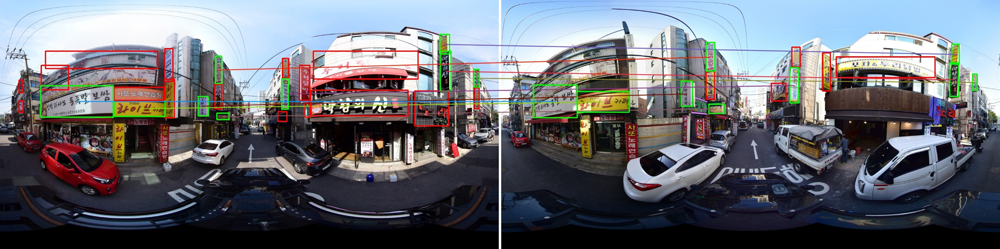
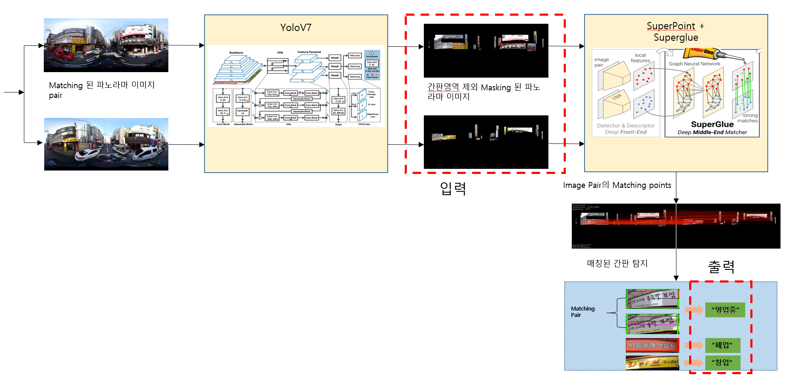

# Signboar Retrieval with LoFTR
본 프로젝트는 LoFTR을 이용해 상가간판 매칭기술을 구현한 프로젝트입니다.

## Introduction
본 모듈은 한 쌍의 로드뷰 파노라마 이미지와 SCA-ObjectDetection 모듈의 결과를 입력으로 받아 동일한 간판끼리 매칭하는 기능을 담당합니다.

간판 매칭에는 LoFTR feature matching을 이용하였으며 본 모듈의 시각화 결과는 아래 이미지와 같습니다.


## Pipeline


## Project Architecture
```shell
.
├── README.md
├── data                        # data 디렉토리
├── docker                      # docker container 구축을 위해 필요한 설정파일
├── docker-compose.yml          # docker-compose 환경 설정 파일
├── docs                        # Readme 작성에 필요한 파일
├── models                      # Superglue 관련 weight 및 모듈
├── eval.py                     # Superglue SignMatching 성능 평가를 위한 모듈
├── main.py                     # Superglue SignMatching 추론 모듈
├── requirements.txt            
├── scripts      
│   ├── download.sh             # 성능평가 데이터셋 다운로드 스크립트        
│   └── download_weights.sh     # Superglus 모델 다운로드 스크립트         
└── utils
    ├── __init__.py
    └── common.py               # 모듈 실행을 위한 유틸리티

```


## Installation
본 프로젝트는 Docker 컨테이너 상에서 실행하기를 권장합니다.

설치 방법은 아래 링크 참조

[HowToInstall.md](https://github.com/sogang-mm/SCA-SignMatching/tree/LoFTR/docs/HowToInstall.md)

## Inference
추론 방법은 아래 링크 참조

[HowToInfer.md](https://github.com/sogang-mm/SCA-SignMatching/tree/LoFTR/docs/HowToInfer.md)

## Evaluation
### Best F1-score
| Recall | Precision | F1-score |
|--------|-----------|----------|
| 0.85   | 0.77      | 0.81     |

평가 결과 및 평가 방법은 아래 링크 참조

[HowToEvaluate.md](https://github.com/sogang-mm/SCA-SignMatching/tree/LoFTR/docs/HowToEvaluate.md)

## How to run RESTful API Server
### Start API Server
* 아래 명령어를 순차적으로 수행하면 docker container 내에서 background로 실행됩니다.
```shell
# in Host
git clone -b LoFTR https://${PERSONAL_TOKEN}@github.com/jaechanjo/Signboard_Retrieval.git LoFTR
cd LoFTR/
docker-compose up -d --build
docker attach LoFTR_main

# in docker container
source ~/.bashrc
sh scripts/entrypoint.sh 
sh scripts/server_start.sh
```
### Shutdown API Server
* 아래 쉘스크립트 명령어를 수행하면 background로 실행 중인 API 서버가 종료됩니다.
```shell
sh scripts/server_shutdown.sh
```
