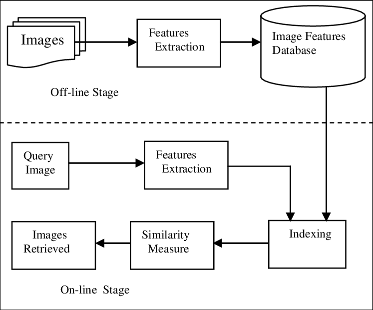

# 간판 특징 추출 엔진

### Dataset

파노라마 뷰 이미지 

### Input/output
input: 쿼리, 데이터 베이스 파노라마 내 간판 이미지  
output: 매칭된 쿼리 간판 이미지, 매칭된 데이터 베이스 간판 이미지, 간판 간 유사도가 높은 순으로 저장된 텍스트 파일  
ex) 0,0,0.20163237

### Learning based feature extractor s**ystem**



```bash
#1. Extract Image Feature
python feature_extractor.py

#2. Get retrieval ranking
python rank.py
```

1. 쿼리, 데이터베이스 각 파노라마 이미지에서 크롭된 간판 이미지들의 피처 추출
2. 쿼리, 데이터베이스의 간판 피처의 유사도를 비교 후 유사도 높은 순으로 순위 정렬

### Model

Swin Transformer(ImageNet-22K Pretrained), 384x384 size, last swintransformer block feature 

[https://github.com/microsoft/Swin-Transformer](https://github.com/microsoft/Swin-Transformer)

### Argument

--result_path=ViT로 inference한 간판 매칭 결과 저장 경로
